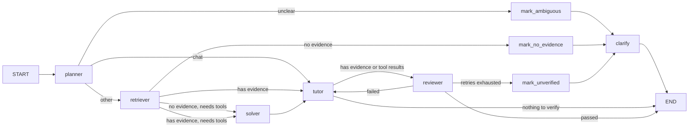

# Study Helper Agent

A local-first study assistant built on LangChain + LangGraph and Qwen (can be replaced).
Point it at your own lecture notes and textbooks, ask questions in natural language, and get
answers that cite the exact page, heading, or line they came from.

The CLI parses, chunks, and stores vectors locally. The Web chat/Vision path can send configured
inputs to the selected model provider; chat images are temporary and are never automatically
indexed into RAG.

## Features

- **Grounded Q&A over your own files** — PDF, Markdown, and TXT. Every claim carries a citation
  such as `lecture.pdf p.18` or `notes.md > Chapter 3 > 3.2 Eigenvalues`.
- **Multi-agent graph** — six single-responsibility nodes (Planner / Retriever / Solver / Tutor /
  Reviewer / Clarify) wired as a LangGraph `StateGraph` with conditional routing, review-and-rewrite
  retries, and a fallback that asks the user a clarifying question instead of guessing.
- **Tool calling with guardrails** — safe AST-based calculator, Tavily web search, and flashcard
  generation, all wrapped with per-call timeout, bounded retry, a per-turn call budget, and JSONL
  traces.
- **Incremental ingestion** — a content-hash manifest makes re-ingesting idempotent: only new and
  changed files are re-chunked, and chunks of deleted files are cleaned up.
- **Session memory** — conversation history is persisted per session and survives restarts.
- **Regression eval harness** — 38-question set measuring Recall@k, citation precision, refusal
  accuracy, and latency.
- **Phase 5 service** — FastAPI Bearer-authenticated API, SSE chat, explicit upload/index jobs,
  versioned user-scoped RAG, structured Vision confirmation, standalone HTML/CSS/JS client, export/delete,
  rate limits, audit events, Prometheus metrics, and Docker Compose roles.

Run the API with `python api_server.py` and open `http://127.0.0.1:8000` for the standalone HTML/CSS/JS client. In
development, `Bearer dev-token` is the only accepted credential. Uploading a file only stores it;
call `POST /v1/files/{file_id}/index-jobs` with an `Idempotency-Key` to start embedding. See
[`PHASE5_PRODUCT_PRD.md`](PHASE5_PRODUCT_PRD.md) for the endpoint contract and production
backend boundaries.

## How it works



| Node | Responsibility |
|---|---|
| `planner` | Classify intent (`qa` / `chat` / `calc` / `search` / `flashcard` / `unclear`) and decide whether tools are needed |
| `retriever` | Vector search over the local knowledge base, returns cited evidence |
| `solver` | Step-by-step reasoning and tool use (the only node that touches tools) |
| `tutor` | Rewrites evidence into a teaching-style answer — the sole producer of the final answer |
| `reviewer` | Checks citation alignment, arithmetic, and hallucination; sends the answer back when it finds real problems |
| `clarify` | Asks the user a question when the request is vague, evidence is missing, or the answer cannot be verified |

An answer is only shipped after it passes review; if review fails twice, the graph degrades gracefully
into a clarifying question rather than returning an unverified answer.

## RAG Evaluation

Reports Recall@k, citation precision, refusal accuracy, and average latency, then lists failing
cases. Non-zero exit code means at least one question failed.

Current baseline (`--no-llm`, 38 questions, `top_k=4`):

| Metric | Value |
|---|---|
| Recall@4 | 74.3% (29/38) |
| Citation precision | 18.6% |
| Avg. latency | 0.80 s |

Citation precision is well below the 90% target — reranking and hybrid retrieval are the next
focus areas.

## Project layout

```
learning_agent/
├─ main.py             # CLI entry point (display only; all logic lives in the packages)
├─ config.py           # .env-backed configuration
├─ llm.py              # chat model factory
├─ memory/             # memory package (same module layout style as rag/)
│  ├─ __init__.py      # public interfaces
│  ├─ short_term/      # LangGraph checkpoints and session registry
│  │  ├─ checkpoint.py # SQLite saver initialization and thread config
│  │  ├─ store.py      # thread registry, ownership, listing and clearing
│  │  ├─ legacy.py     # legacy JSON adapter and one-time migration
│  │  └─ pipeline.py   # cross-layer store lifecycle
│  ├─ long_term/       # facts, knowledge points and review plans
│  │  ├─ database.py   # learning.sqlite schema
│  │  ├─ repository.py  # transactional long-term memory store
│  │  ├─ extraction.py # source-bound candidate extraction
│  │  ├─ knowledge.py  # knowledge-point service facade
│  │  ├─ scheduler.py  # interval_v1 review facade
│  │  ├─ schemas.py    # long-term memory contracts
│  │  ├─ service.py    # turn commit and automatic extraction
│  │  └─ privacy.py    # cross-layer export and deletion
├─ frontend/           # standalone browser client
│  ├─ index.html       # page structure
│  ├─ css/styles.css   # visual system and responsive layout
│  └─ js/app.js        # API calls, chat, sessions and archive views
├─ graph/              # LangGraph orchestration
│  ├─ state.py         #   TaskState and the AgentResult contract
│  ├─ nodes.py         #   the six agent nodes and their prompts
│  └─ builder.py       #   routing functions and graph assembly
├─ rag/                # retrieval pipeline
│  ├─ loader.py        #   PDF / Markdown / TXT loading with metadata
│  ├─ splitter.py      #   format-aware chunking that preserves heading paths and line numbers
│  ├─ embedder.py      #   DashScope embedding wrapper
│  ├─ store.py         #   local Chroma vector store
│  ├─ manifest.py      #   content-hash manifest enabling incremental ingest
│  ├─ retriever.py     #   search plus citation formatting
│  └─ pipeline.py      #   index / sync / ask entry points
├─ tools/              # tool registry and implementations
│  ├─ registry.py      #   budget, timeout, retry, tracing guardrails
│  ├─ calculator.py    #   AST-based safe math evaluation
│  ├─ web_search.py    #   Tavily search
│  └─ flashcard.py     #   flashcard generation
├─ evaluation/         # regression harness and 38-question dataset
└─ data/               # local documents, vector store, memory, traces (git-ignored)
```

## Status

**Implemented:** RAG pipeline with incremental indexing, guarded tool calling, LangGraph
multi-agent orchestration, long-term learning profiles, multimodal input, a FastAPI/SSE service,
and a standalone HTML/CSS/JS browser client.

## Requirements

- Python 3.11+
- An Alibaba Cloud DashScope (Model Studio) API key — used for both chat and embeddings. (Plan to support more providers and models in the future stage)
- Optional: a [Tavily](https://tavily.com) API key to enable web search

## Install

```bash
pip install -r requirements.txt
```

## Configure

All configuration lives in `.env` (git-ignored; see `config.py` for defaults).

| Variable | Purpose |
|---|---|
| `DASHSCOPE_API_KEY` | DashScope API key (required) |
| `DASHSCOPE_BASE_URL` | OpenAI-compatible chat endpoint (required) |
| `LLM_MODEL` | Chat model name, default `qwen-plus` |
| `LLM_TEMPERATURE` | Sampling temperature, default `0.7` |
| `EMBEDDING_API_KEY` | Separate key for embeddings (falls back to `DASHSCOPE_API_KEY`) |
| `EMBEDDING_BASE_URL` | Embedding endpoint |
| `EMBEDDING_MODEL` | Default `text-embedding-v4` |
| `EMBEDDING_DIMENSION` | Vector dimension, default `1024` |
| `DATA_DIR` | Document folder to ingest, default `./data/uploads` |
| `CHROMA_PERSIST_DIR` | Vector store location, default `./data/chroma` |
| `COLLECTION_NAME` | Chroma collection name |
| `TAVILY_API_KEY` | Enables the `web_search` tool when set |
| `MAX_TOOL_CALLS` / `TOOL_TIMEOUT` / `TOOL_MAX_RETRIES` | Tool guardrails |
| `REVIEW_MAX_ROUNDS` | Max review rounds before falling back to a clarifying question |
| `LANGSMITH_TRACING` / `LANGSMITH_PROJECT` | Optional LangSmith tracing |
| `CHECKPOINT_DB` | SQLite checkpoints, default `./data/memory/checkpoints.sqlite` |
| `MEMORY_HISTORY_MAX_MESSAGES` | Recent history sent to the model, default 20, plus current input |

## Run

```bash
python main.py                     # start chatting (documents go in ./data/uploads)
python main.py --session math      # separate memory per session
python main.py --user alice --session math # independent local user namespace
python main.py --ingest            # incremental ingest, then exit
python main.py --ingest --all      # ignore the manifest, re-chunk everything
python main.py --ingest --path notes.pdf
```

In-chat commands:

| Command | Effect |
|---|---|
| `/ingest [path]` | Incremental ingest (only new and changed files) |
| `/ingest --all` | Full re-index |
| `/tools` | List available tools and guardrail limits |
| `/graph` | Print the graph's Mermaid source |
| `/stats` | Vector store status |
| `/new` | Clear the current session memory |
| `/resume` | Resume an interrupted graph turn |
| `/threads` | List the current user's sessions |
| `/session name` | Create or switch sessions |
| `/exit` | Quit |

Sessions use persistent LangGraph `SqliteSaver` checkpoints and UUID thread IDs.
Restart with the same `--user` and `--session` to continue. Session names do not
change document ownership; use the same `--user` for ingest and chat.
The default user's old JSON history is imported once after validation. Old files
remain as backups but are no longer updated. `/new` deletes all checkpoints and
prevents those backups from being imported again; it does not erase backup files.

Only final answers enter conversation history; per-turn evidence and review
outputs are reset. An unfinished turn blocks new questions until `/resume` or
`/new`. Resuming a failed tool node can repeat external side effects, including
flashcard writes; tool replay deduplication is a later milestone. This is a local
single-process CLI, and `--user` provides namespacing rather than authentication.
New flashcards and traces are stored under a safe user directory and are included in full-user deletion.
Long-term facts, knowledge points, and the deterministic `interval_v1` review plan are stored in the separate `LEARNING_DB` (default `data/memory/learning.sqlite`). Explicit goals/preferences/learning difficulties are extracted with source quotes; uncertain candidates are handled with `/memory confirm` or `/memory reject`. Use `/memory`, `/knowledge`, `/review today`, `/review feedback`, `/data export`, and `/data delete` for the Phase 4 CLI.

Offline integration tests: `python -m unittest discover -s tests -v`.
Programmatic `graph.run(..., thread_id=...)` uses a thread registered through
`memory.thread_store().get_thread(user_id, name)`. Calls without `thread_id` remain
ephemeral and support the old `history` parameter without writing checkpoints.

## Documentation

- `PROJECT_PLAN.md` — design, contracts, and roadmap (Chinese)
- `PROGRESS.md` — what is done, what is verified, known issues (Chinese)
- `README.zh-CN.md` — Chinese version of this file
